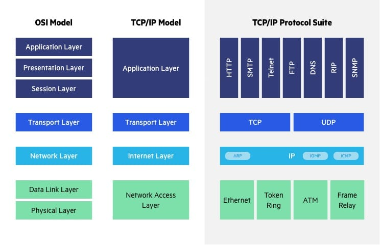

# March 02~08

## Day 07
- SWEA 5215 햄버거 다이어트 __*SOLVED!!*__
- `git config` 를 바꾸지 않아 모든 `commit` 이 솔빈이의 이름으로 올라가다...! 앞으로는 유의할 것!

## Day 08
- 리눅스 마스터 2급 2차 시험 응시 완료!!
    - 네트워크 관련 공부 필요
        - e.g. OSI 7 계층 전송 단위, IP 주소 클래스, 서브넷 마스크, 리눅스 명령어 (ifconfig, netstat, route)
    - LVM (Logical Volume Management) 관련 공부 필요
        - PV (Physical Volume) -> VG (Volume Group) -> LV (Logical Volume)
- 델타 탐색, 자바 기본 자료형 공부

### OSI 7 계층

| No. | 계층 | 프로토콜 | 전송 단위 | 장비 | TCP/IP 모델 |
|---|---|---|---|---|---|
| 7 | 응용 (어플리케이션) | HTTP, FTP, TELNET, SSH, DNS ... | - | L7 스위치 | 응용 (어플리케이션) |
| 6 | 표현 | FTP, IMAP, SSH ... | - | - |  |
| 5 | 세션 | NFS ... | - | - |  |
| 4 | 전송 | TCP, UDP | TCP : segment / UDP : datagram | 게이트웨이, L4 스위치 | 전송 |
| 3 | 네트워크 | IP | packet | 라우터, L3 스위치 | 인터넷 |
| 2 | 데이터링크 | - | frame | 스위치, 브릿지 | 네트워크 엑세스 |
| 1 | 물리 | - | bit | 허브, 리피터 |  |

### 자바 기본 자료형

| 분류 | 타입 | 크기 | 기본값 |
|---|---|---|---|
| 논리형 | **boolean** | 1bit | false |
| 문자형 | **char** | 2byte | \u0000 |
| 정수형 | byte | 1byte | 0 |
|  | short | 2byte | 0 |
|  | **int** | 4byte | 0 |
|  | long | 8byte | 0L |
| 실수형 | float | 4byte | 0.0f |
|  | **double** | 8byte | 0.0 |

- int 값의 범위는 약 -20억 ~ 20억
    - 문제에서 주어진 수가 20억 이상이라면 **long** 을 사용하여 처리해야 한다
- char 의 기본값은 **\u0000**
    - 숫자 0 은 **48** / 알파벳 대문자 A 는 **65** / 알파벳 소문자 a 는 **97**
        - 대문자 = 소문자 - 32
    - char : `' '`
    - String : `" "`
- `(int) char` -> 문자를 숫자로 변환
- `(char) int` -> 숫자를 문자로 변환
